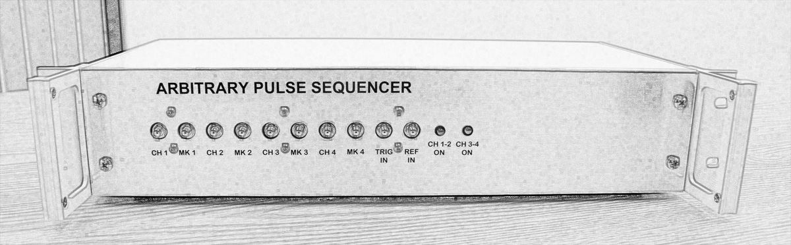

Welcome to libaps's documentation!
==================================

The BBN Arbitrary Pulse Sequencer (APS) is an arbitrary waveform generator with
an advanced sequencing ability. The sequencer allows for specification of
individual operations (gates) to be defined as units in a waveform library, so
that an algorithm/experiment can be defined by stringing together sequences of
gates and delays. This results in a very compact description for efficient
memory use.

Contents:

.. toctree::
   :maxdepth: 2

   quickstart
   installation
   api
   sequencefiles
   specs

Indices and tables
==================

* :ref:`genindex`
* :ref:`search`
