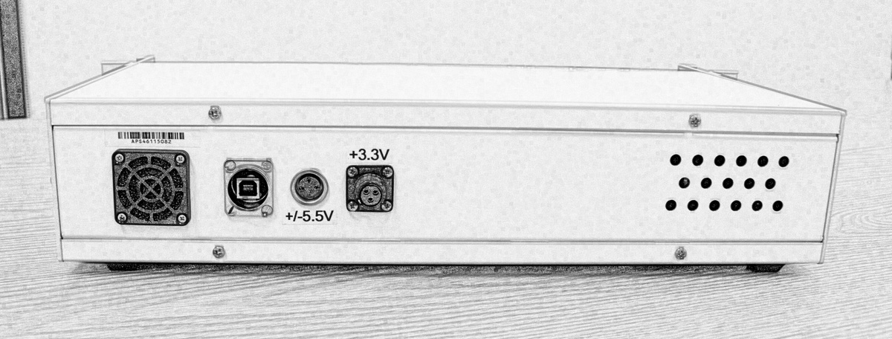

Installation Guide
==================

Hardware
--------

The BBN APS has separate enclosures for the power supply and analog
front-end. A single power supply module has two 5.5V outputs and two
3.3V outputs, which is sufficient to power two analog modules. Using the
supplied cables, connect a pair of power outputs with the same label
(PS1 or PS2) to the power inputs on the rear of an analog module. It is
important to maintain the labeled pairing when connecting to the analog
modules in order to ensure proper power sequencing and optimal noise
performance. These outputs are not hot-pluggable; one must ensure that
the power switch on the front of the supply module is in the off
position before connecting or disconnecting the power cables.

.. _fig-aps-rear-panel:

  **BBN APS rear panel.** The rear panel of the APS has a USB connect as well as
  3.3V and 5V power supply inputs. Be careful to connect power outputs on the
  power supply with the same number in order to obtain the best noise
  performance from the device. Never unplug the cables from the power inputs
  while the power supply is on.

Once the power supply has been connected, turn the APS on with the power
switch on the front of the power supply. At this point, the FPGAs in the
analog module are in a blank state, awaiting upload of the pulse
sequencer firmware over the USB interface.

The BBN APS requires a USB driver in order to communicate with the host
PC. Prior to plugging the APS into the host computer, you should
download and unzip the driver from the FTDI website
(http://www.ftdichip.com/Drivers/D2XX.htm). After connecting to a
Windows XP/Vista/7 machine, the ‘new hardware’ wizard will open.
Occasionally Windows will find an appropriate driver without further
input, but more often you will need to supply the path to the FTDI
driver folder.

While the APS can run in a standalone configuration, we recommend
running with a 10 MHz (+7 dBm) external reference. This reference must
be supplied at the corresponding front panel input before powering on
the device. Multiple devices can be syncronized by supplying an
appropriate external trigger.

Software
--------

The APS is driven by a C/C++ library. We have provided MATLAB, python,
and LabVIEW bindings to this library such that use of the APS is as
similar as possible in the various instrument control environments. The
library is bundled into a release package that is available in the
‘downloads’ section of the BBN quantum group website
(http://bbn.com/technology/quantum/tools/aps). This library seamlessly
integrates into BBN’s Qlab framework for control and analysis of
superconducting qubit systems.

Download the latest ``aps-release-X.X.7z`` file from the
tools\ :math:`\rightarrow`\ downloads section. To use these drivers
outside of the Qlab suite, you simply need to add the relevant paths to
your MATLAB or python code.

To add the APS driver to an existing Qlab installation, download the
same ``aps-release-X.X.7z`` file. Copy the ``bitfiles`` directory to
``QLABROOT/hardware/APS/`` and copy ``libaps-cpp/build32`` and
``libaps-cpp/build64`` to ``QLABROOT/hardware/APS/libaps-cpp/``.

Python requirements
~~~~~~~~~~~~~~~~~~~

The BBN APS driver for Python requires Python 2.7 or later (but not
Python 3+). You also need a working installation of NumPy and h5py; the
later is easily available via *easy\_install* or *pip* on Unix-like
systems (including Mac OS). Building NumPy is a fairly complicated
procedure; therefore, we recommend obtaining a pre-built version with
your platform’s package manager (Linux) or use a Python setup that
already includes NumPy, such as Enthought or Python(x,y) (Windows).
Alternatively, you may consult online resources to find how-to guides
for compiling NumPy on your system.

MATLAB requirements
~~~~~~~~~~~~~~~~~~~

The BBN APS driver for MATLAB requires MATLAB 2010a or later. The driver
does not depend on any toolkits, so a vanilla install is sufficient.

LabVIEW requirements
~~~~~~~~~~~~~~~~~~~~

The BBN APS driver for LabVIEW requires only a relatively recent LabVIEW
installation that supports object-oriented instrument classes (2008 or
later).

Standalone GUI control program
------------------------------

A standalone Win32 application is available for controlling the BBN APS.
This application is available on the downloads section of the BBN Qlab
repository on Github.
