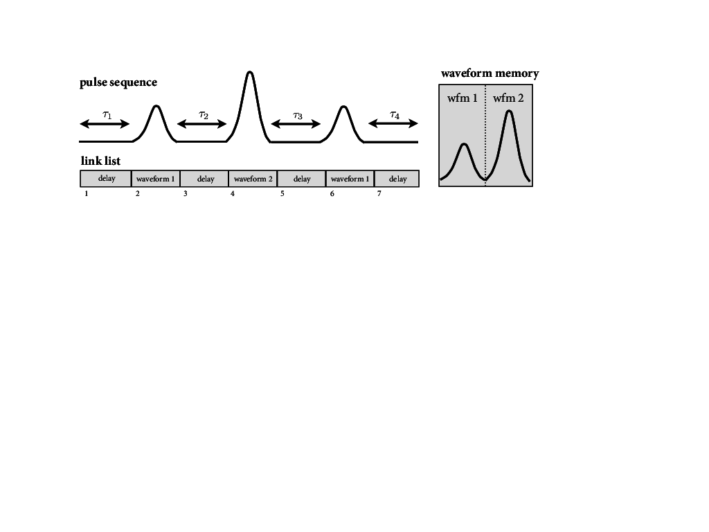

.. _sec-sequence-files:

Sequence Mode and File Specification
====================================

In addition to outputting waveforms of up to 32,768 points, the APS
supports a sequence mode that outputs a series of pulses from the
waveform memory. This sequence definition table, known as a ‘link list’,
can store up to 8,192 entries. The APS’s dual-port memory architecture
allows the driver software to stream data to the sequence memory while
the device is running. If configured such that an individual sequence
duration is longer than the transfer time (:math:`\sim 10\,\mathrm{ms}`
per channel), then the APS can output a nearly continuous stream of
pulses. Use of this streaming mode of operation is largely transparent
to the user. One simply asks to load some sequence data to the APS, and
if there are more entries than can fit onto the device memory, the
driver will use streaming mode automatically.

The APS sequence mode requires the construction of a set of one or more
link lists. The APS begins output of each link list upon receipt of a
trigger, which can be supplied at the external trigger input of the
analog module, or it can be generated internally. Each link list is
composed of one or more entries, which can be any of the following
types:

-  **waveform** - an analog pulse defined by a section of waveform
   memory

-  **time/amplitude pair** - a constant amplitude signal of a specified
   duration

-  **delay** - a time/amplitude pair with amplitude zero

Each entry may also specify a transition in the output of the associated
digital (marker) channel. In particular, one can specify the position of
a rising edge, falling edge, or pulse at a delay from the beginning of
the output of the entry.

The APS firmware allows for an additional division of each link list
into sub-sequences known as ‘mini link lists’. This allows the user to
specify sequences with repeated sections, or sections which should wait
for a trigger to output. One use of this feature is to specify sets of
experiments which scan over some parameter such as a delay or a pulse
height, and take the data in a ‘round robin’ mode, as supported by many
digitizers.

Figure :ref:`fig-pulse-sequence` shows an example of a Hahn echo experiment
(:math:`\pi/2`-pulse, wait :math:`\tau`, :math:`\pi`-pulse, wait
:math:`\tau`, :math:`\pi/2`-pulse) specified as a link list. The
waveform memory (right panel) contains just two pulses, corresponding to
the :math:`\pi/2` and :math:`\pi` pulses. Then the link list (bottom)
joins these pulses together with appropriate delays.

.. _fig-pulse-sequence:

  **Example pulse sequence:** A simple pulse sequence that might occur in a Hahn
  echo experiment as implemented using a link list. Note that one can test
  very long delays because the data stored in waveform memory is independent
  of the experiment delays.

File Specification
-------------------

Sequences are programmed using an HDF5 file with the following layout (n is an integer between 1-4):

| /version - attribute indicating file version number
| /channelDataFor - attribute containing array of integers specifying channels for which data is supplied in the file
| /miniLLRepeat - attribute containing default number of times to repeat each mini link list (0 = play without repeats)
| /chan_n/isListListData - integer attribute specifying whether link list data is supplied for this channel
| /chan_n/isIQMode - integer attribute specifying whether this channel contains data for an I/Q pair (default = 1)
| /chan_n/waveformLib - int16 vector of 14-bit waveform values, sign-extended to 16-bits
| /chan_n/linkListData/length - integer attribute specifying number of link list entries
| /chan_n/linkListData/addr - int16 vector of waveform addresses
| /chan_n/linkListData/count - int16 vector of waveform lengths
| /chan_n/linkListData/repeat - int16 vector of repeats
| /chan_n/linkListData/trigger1 - int16 vector of offset counts for trigger1 pulses
| /chan_n/linkListData/trigger2 - int16 vector of offset counts for trigger2 pulses

Link list field formats
-----------------------

An individual sequence entry consists of a value from each of the addr, count,
repeat, trigger1, and trigger2 fields. Data is encoded in these fields in the
following way:

Address: 16-bit offset in quad samples into waveform memory.

Count: length of waveform in quad samples minus one. For example, a waveform
that is 16 samples long has count = 3. The minimum count is 2.

Repeat: 10-bit repeat count for the waveform. Bits 10-11 are reserved. Bit 15
is the START_MINILL flag. Bit 14 is the END_MINILL flag. Bit 13 is the
WAIT_FOR_TRIG flag. Bit 12 is the TA_PAIR flag.

Trigger1/2: offset in quad samples to output a trigger pulse on the
corresponding marker output channel. A value of zero means no pulse.
Accordingly, it is not possible to have a pulse aligned with the first sample
of a waveform.
