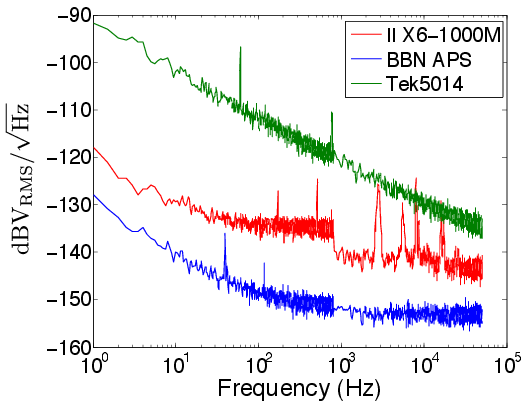

Specifications
===============

Each unit has four 14-bit 1.2 GS/s analog output channels and four 300 MS/s
digital marker channels. The clocks can be synchronized to an external 10 MHz
reference. The device can be triggered internally or via an external trigger
input. The device uses low-noise linear power supplies with an ultra-low-noise
buffer amplifier on the DAC outputs to provide a system noise comparable to a 1
kOhm resistor.

The BBN Arbitrary Pulse Sequencer (APS) is USB slave module with four
1.2 GS/s 14-bit analog output channels and four 300 MS/s digital marker
channels. A high-bandwidth amplifier buffers the DAC outputs to drive a
50 ohm load to ±1V full-scale. High-speed LatticeSC3 FPGAs generate 600
MHz DDR sample streams for the DAC channels. Low-skew, low-jitter 300
MHz and 1.2 GHz clocks from a PLL clock generator drive the FPGAs and
the DACs. The clocks can be phase locked to an external 10 MHz
reference.

The voltage noise of the APS is limited by the noise performance of the
last-stage output amplifier, an Analog Devices AD8099. The measured
noise at the analog channel outputs is shown in Fig [fig:noise]. Careful
engineering of the power supplies and analog/digital ground plane
separation lead to system noise performance that is orders of magnitude
better than some commonly used waveform generators.

  **Comparison of AWG output noise.** Output noise power versus frequency for the
  Tektronix AWG5014, Innovative Integration X6-1000M, and BBN APS. The APS’s
  linear power supplies and low-noise output amplifier lead to signficant
  improvements in the noise performance. The II X6 is significantly better than
  the Tek5014, but suffers from resonances in the noise spectrum because it is
  in a host PC environment.

Detailed Specifications
-----------------------

==============================  ===================
Parameter                          Value
==============================  ===================
Analog channels                 four 14-bit 1.2 GS/s outputs
Jitter                          28 ps RMS (71 ps peak-to-peak)
Rise/fall time                  2ns
Settling time                   2 ns to 10%, 10 ns to 1%
Digital channels                four 300 MS/s capacitvely coupled outputs
Trigger input                   1 V minimum into :math:`50\,\mathrm{\Omega}`, 5 V maximum; triggered on *rising* edge
Waveform memory                 32,768 samples per channel
Sequence memory                 8,192 entries per channel (unlimited with streaming)
Minimum sequence pulse length   12 samples (10 ns)
Maximum sequence pulse length   27 us waveform, or 8 s time-amplitude pair
Minimum sequence length         2 entries
==============================  ===================
